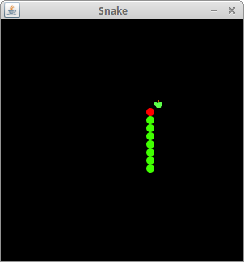
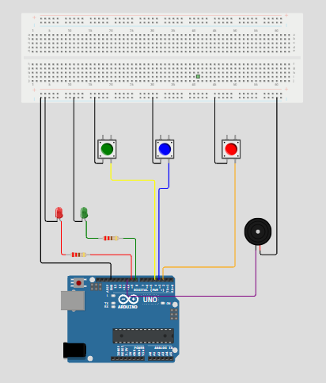

# Arduino-Controlled Java Snake Game 🐍🎮

A hybrid physical-digital retro Snake game built using **Java Swing** for the game graphics and an **Arduino Uno microcontroller** for physical hardware controls, sound effects, and LED feedback.

---
## 📂 Documentation on the Web
🌐 https://snake-game-two-hazel.vercel.app/

---

## 📸 Game Overview & Preview



## 📸 Snake game Arduino uno schame


This project bridges software engineering and physical computing via **Serial Communication (USB)**. Instead of using your computer keyboard, you play the classic Snake game using physical push buttons wired to an Arduino.

* **Java Laptop App:** Manages the game grid, snake rendering, collision detection, and score tracking using standard Java Swing classes (`Snake.java`, `Board.java`).
* **Arduino Hardware:** Acts as an external input/output peripheral, reading player inputs and handling dynamic visual/audio cues (countdown chimes, game-over alerts).

---

## 🛠️ Hardware Setup & Pin Mapping

The circuit consists of three push buttons, two LEDs, and a buzzer connected to an Arduino Uno[cite: 4]:

| Component | Arduino Pin | Description |
| :--- | :--- | :--- |
| **Left Turn Button** | Digital Pin 2 | Pull-up button to steer the snake counter-clockwise |
| **Right Turn Button** | Digital Pin 3 | Pull-up button to steer the snake clockwise |
| **Start Button** | Digital Pin 4 | Pull-up button to trigger countdown and launch the game |
| **Green LED** | Digital Pin 8 | Lights up during the countdown and active gameplay |
| **Red LED** | Digital Pin 9 | Lights up when a game-over crash occurs |
| **Buzzer** | Digital Pin 10 | Plays "tit tit tit" countdown tones and a descending game-over melody |

---

## 📂 Project Directory Structure

```text
JAVA-SNAKE-GAME/
│
├── src/
│   ├── com/
│   │   └── zetcode/
│   │       ├── Board.java      # Game logic, UI painting, and serial listener
│   │       └── Snake.java      # Main application window frame[cite: 2]
│   └── resources/
│       ├── apple.png           # Food asset[cite: 2]
│       ├── dot.png             # Snake body asset[cite: 2]
│       └── head.png            # Snake head asset[cite: 2]
│
├── jSerialComm-2.11.4.jar      # Serial communication library
├── README.md                   # Project documentation
├── snake.png                   # Game overview screenshot preview
└── sketch.ino                  # Arduino microcontroller source code
